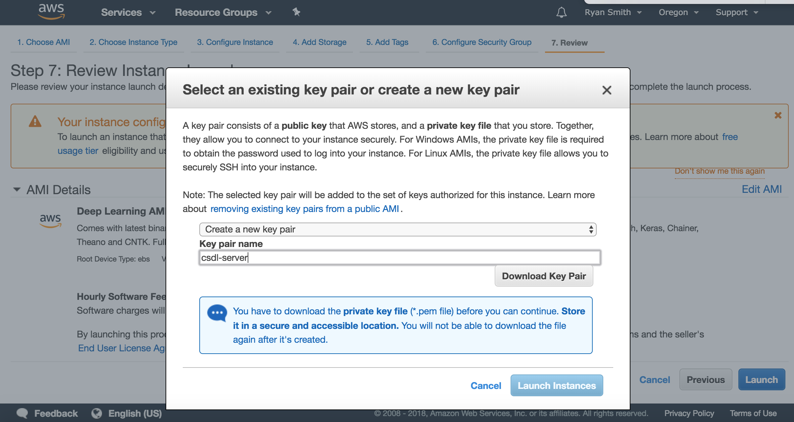

# Getting Started With AWS

Our laptops won't be sufficient for training deep neural networks on large training sets. We'll use AWS (Amazon Web Services) to set up a server with access to a GPU that will help us train our networks much more efficiently. Amazon Web Services is a cloud service provider used widely in industry, and having a strong foundation in creating and managing AWS resources is an important skill for machine learning engineers.

# Why GPUs

A GPU, or Graphics Processing Unit, is a processor that specializes in highly parallel tasks. Originally intended for rendering high resolution images efficiently, GPUs now have a variety of applications in machine learning, blockchain technologies, cryptography, and computer science research. They are useful in training deep learning models because they are designed to process large amounts of data in parallel, which is exactly what happens when we feed data forward through a network or perform backprop. For instance, matrix multiplication can be accelerated by performing individual dot product in parallel.

# Launching a Server on AWS

1. If you haven't already, [sign up for an AWS account](https://aws.amazon.com/)
1. Once you have logged in, you will see the home screen for the AWS console. It should look something like this:

1. In the search bar, search for the service called EC2. EC2 stands for Elastic Compute Cloud, and is a service that spins up virtual servers. The EC2 dashboard should look like this:

1. Hit the blue Launch Instance button that appears in the Create Instance section of the dashboard. This will take us to a wizard that leads us through creating a new server.
1. We need to select an Amazon Machine Image (AMI) to use as a base for our server. An AMI is similar to a Docker image, but specialized for starting up virtual machines on EC2 servers. An AMI specifies the operating system, dependencies, and environment for the virtual machine we will be starting. Select the AWS Marketplace tab on the sidebar and search for "Deep Learning AMI (Ubuntu)":

1. Select this AMI. A screen will pop up with information about pricing. Hit continue.
1. Next we must pick the Instance Type. This step will determine the computational resources our virtual server has access to. By default, you should see that the p3.2xlarge instance is selected. This EC2 instances have access to GPUs and memory that will allow us to train large models. Hit the blue Review and Launch button on the bottom of your screen.
1. Now you should see a screen that says "Step 7: Review Instance Launch". Hit the blue Launch button in the lower right corner.
1. You should see a screen that prompts you to choose a key pair. This key pair will allow you to connect to your EC2 instance via SSH. Select "Create a new key pair" and name your key pair "csdl-server". Hit Download Key Pair. Once you've downloaded the "csdl-server.pem" file, hit the Launch Instances button.

1. Your EC2 Instance may take a moment to launch. Navigate back to the EC2 dashboard.

# Connecting to Your Server

1. You have now started a virtual server. You can use its public DNS to connect to it via ssh. From the EC2 Dashboard, select your EC2 instance and find its Public DNS (IPv4) address. Copy this, you will use it later.
1. In order to connect to your server, you need to provide it with the private key (a .pem file) you downloaded when you launched the instance. The most common place to store .pem files for ssh access is in a directory called `.ssh`. If you don't already have one, create a directory called `.ssh` in your home directory. Move the key into this directory.
1. We don't want anyone to be able to alter the contents of the key file we've downloaded. Let's update the file permissions to be set so that the .pem file is read only. from the command line, run the command `chmod 400 ~/.ssh/csdl-server.pem`.
1. Make sure you don't have a jupyter process running and using port 8888 on your local machine.
1. Now you're ready to connect to your instance! Run the following command: `ssh -L localhost:8888:localhost:8888 -i ~/.ssh/csdl-server.pem ubuntu@<YOUR PUBLIC DNS ADRESS>`. The -i option specifies a file to use as a key when trying to connect to your server via ssh. The -L option specifies that you wish forward traffic on your local port 8888 to the host port 8888. This will allow you to use a jupyter notebook server running on your EC2 instance as if it were listening to traffic on your local port 8888.
1. Once you have started the ssh session, you should use git to clone your repo with all of the course materials.
1. After you've downloaded the course materials, run `jupyter notebook`. Navigate to localhost:8888 in your browser. Now you can run and update your notebooks on your remote EC2 instance!
1. Remeber to commit and push your work using git. When you are done with your ssh session, use the command `exit` to quit.

# Stopping and Restarted Your Instance

1. After you've committed and pushed your work and have exited your ssh session, its time to stop your EC2 instance. This will keep you from incurring higher charges from AWS. Navigate to your EC2 dashboard and select your machine learning instance. Hit the white Actions buttion in the upper part of your screen. Select the Instance State drop down and then select Stop.
1. When you want to restart your server, select it in the dashboard, and select Actions -> Instance State -> Start. Now your server is starting up.

Notice that when your server starts up again, it's got a different IP address and a different public DNS name than the one it had before. It's kind of a hassle to copy and paste a new url every time you start up your server. In the following section, we set up an Elastic IP that won't change each time we start our server.

# Setting up an Elastic IP

1. Navigate to the EC2 dashboard. Scroll down in the menu on the left hand side to the Network & Security section and select Elastic IPs.
1. Hit the blue Allocate New Address button to claim a new Elastic IP.
1. Once the Elastic IP is created, select it in your dashboard, and then hit Actions -> Associate Address.
1. Select your csdl server instance (you may ignore the other fields). Then hit the blue Associate button.
1. Now there is a single IP address associated with your machine learning server that will persist even when you start and stop your server. From now on, when you connect to your server, you can use the command `ssh -L localhost:8888:localhost:8888 -i ~/csdl-server.pem ubuntu@<YOUR ELASTIC IP>`.
1. The command above is still quite a lot to type. Let's create an alias for this command to make it easier to connect to our server. Open up the proper configuration file for your shell in a text editor (for example, if you are using bash, it's `~/.bash_profile` and for zsh it's `~/.zshrc`).
1. Each time you open a new terminal, this configuration script is run. We can add steps to set up our shell environment here.
1. Add the following line to the end of your shell configuration file : `export CSDL_IP=<YOUR ELASTIC IP>`. This exports an environment variable called `CSDL_IP` that stores your server's elastic IP.
1. Add the following line to the end of your shell configuration file: `alias ssh-csdl="ssh -L localhost:8888:localhost:8888 -i ~/.ssh/csdl-server.pem ubuntu@$CSDL_IP"`. This creates a short alias for the verbose ssh command.
1. Save the file. Quit your terminal program and reopen it. Test that your configuration file was executed by entering the command `echo $CSDL_IP`. You should see your elastic IP printed to the screen.
1. Now try using the alias we defined to connect to your server. Try running the command `ssh-csdl`.

# Extensions

Download the AWS CLI. Use it to write shell scripts that automatically start and stop your machine learning server.
